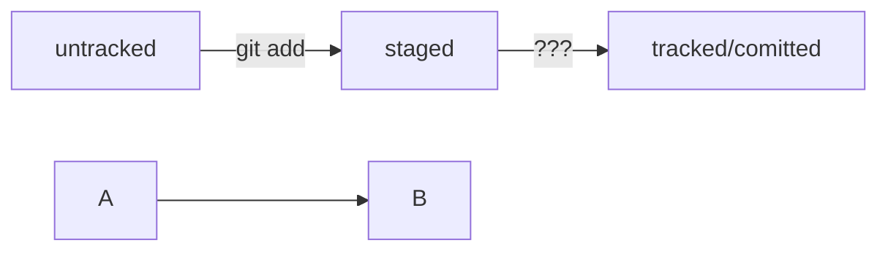

# web-scada

## Back-end part of webserver

```Java
package ru.schung.webscadabulgar.model;

import lombok.Data;

@Data
public class HistoryTelemetry {
    private long valueTime;
    private Double value;
    private String name;
}
```



